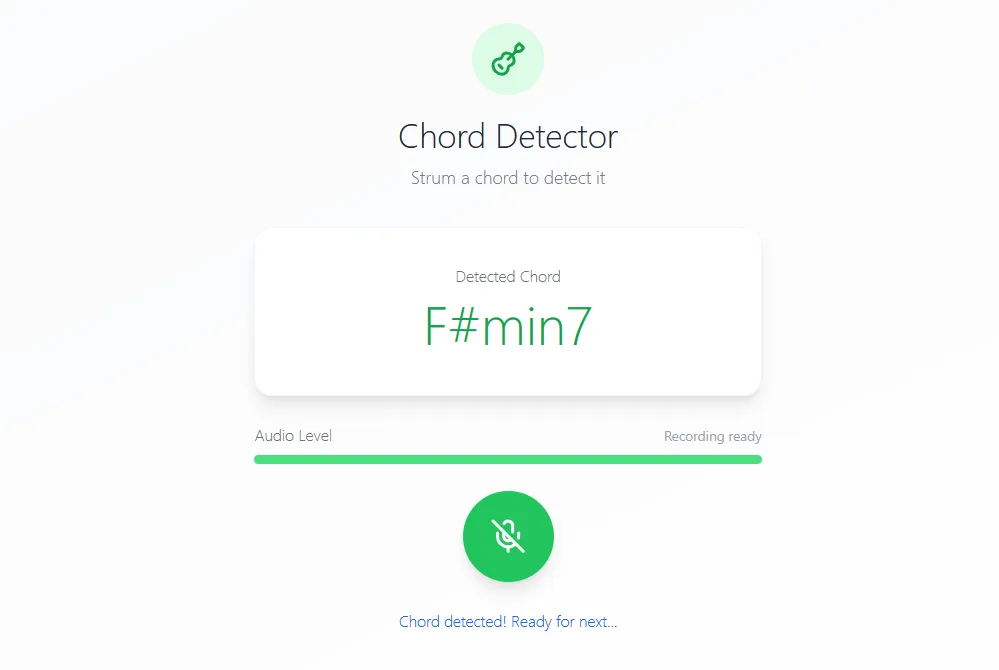
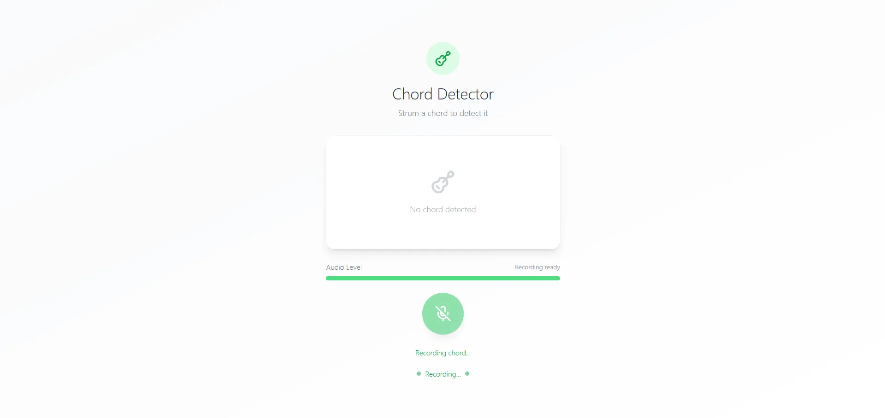

# 🎸 Guitar Chorde — Real-Time Chord Classifier

Guitar Chorde is a real-time chord classification tool that identifies complex chords from audio input using a custom CNN. It supports major, minor, major7, and minor7 chords across all 12 root notes.

---

## 📸 Demo

---

## 🎯 Features

- Trained on 996 self-recorded samples
- Supports 48 chord classes
- 90% train/test accuracy on personal dataset
- Live visualization of predictions using Next.js frontend

---

## 🛠 Tech Stack

- **Frontend**: Next.js, Tailwind CSS, JSX
- **ML/Backend**: TensorFlow, Python, Librosa, Pandas, Flask (optional)
- **Visualization**: Seaborn, Matplotlib

---

## 🧪 Getting Started

1. Clone repository
2. Install dependencies: `pip install -r requirements.txt`
3. Launch model + preprocessing script
4. Run frontend: `npm run dev`

---

## 📚 What I Learned

- Improved speed and structure due to prior full-stack experience
- Learned audio preprocessing with Librosa
- Built my own CNN architecture for audio classification
- Developed a deeper understanding of frontend frameworks like Next.js